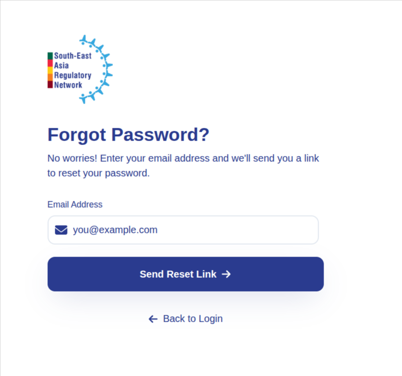
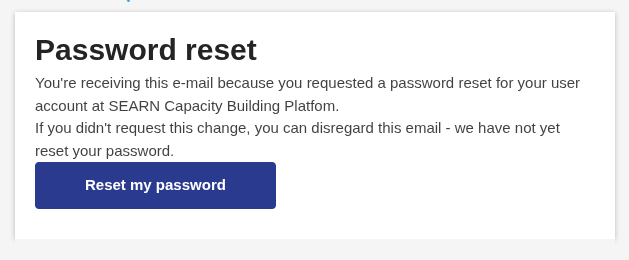
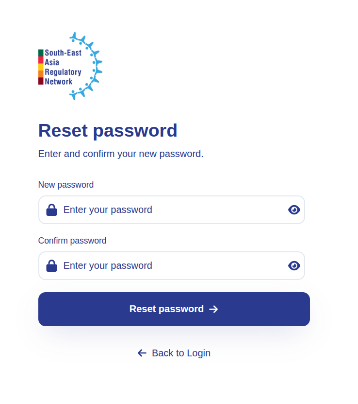

# Logging In

For added security, the platform uses two-step verification. After you enter your email and password, it emails you a one-time passcode (OTP) that you must enter to finish signing in. The starting point is the same for every role.

- Open your browser and go to <https://searn-lms.titaned.com/login>.
- Enter your email and password, checkmark Terms of Use checkbox, then click **Sign In**.

    

- The platform emails a one-time passcode (OTP) to your registered email address. Open your inbox and copy the code.
- Enter the OTP on the verification screen and click **Verify**.

    

- Once the code is verified, you are taken automatically to your Dashboard — the home screen for your role.

!!! warning "Use a valid, accessible email"
    Because the OTP is sent by email every time you log in, you can only sign in if you can open the inbox for your registered address. If the code doesn't arrive within a minute, check your spam folder or click **Resend OTP**.

Your dashboard shows a snapshot relevant to your role (such as pending requests, team status, or training progress) and a left-hand navigation panel. Every task in this guide starts from that left navigation.

!!! success "Outcome"
    You have passed two-step verification and are looking at your role's dashboard. You are ready to begin.

!!! note "Understanding the roles"
    The platform has four pilot roles, each with its own set of tasks:

    - [SEARN Secretariat](secretariat.md) — the central coordinator for the whole network.
    - [NRA Admin / Leadership](nra-admin.md) — owns everything inside one regulatory authority.
    - [NRA Manager](nra-manager.md) — runs the day-to-day work of a team within the NRA.
    - [NRA Staff](nra-staff.md) — completes assigned training and tracks their own growth.

## Reset a Forgotten Password {: #reset-a-forgotten-password }

**The story:** You've forgotten your password and can't get past the sign-in screen.

**Goal:** Reset your password and sign back in.

**Navigation:** Login screen → Forgot Password

- Go to <https://searn-lms.titaned.com/login> and click **Forgot password?**.
- Enter the email address registered to your account and click **Send Reset Link**.

    

- The platform emails you a password reset link. Open your inbox and click **Reset my password**.

    

- On the reset screen, enter a new password, confirm it, then click **Reset password**.

    

- You are returned to the sign-in screen. Sign in with your email and new password as usual.

!!! warning "Use a valid, accessible email"
    The reset link is sent to your registered email address, so you can only reset your password if you can open that inbox. If the email doesn't arrive within a minute, check your spam folder or request the link again.

!!! success "Outcome"
    Your password has been changed, and you can sign back in to your dashboard using the new one.
